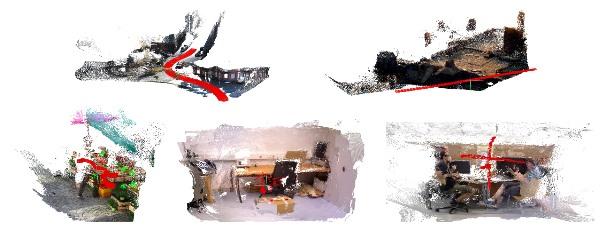
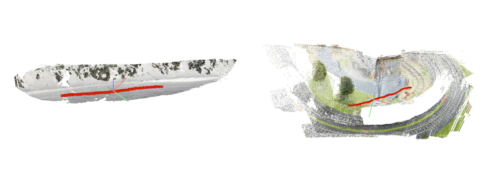

# ParticleSfM
<p align="center">
<h3><a href="https://arxiv.org/abs/2207.09137">Paper</a> | <a href="https://youtu.be/KfFCdOFE6tA">Video</a> | <a href="http://b1ueber2y.me/projects/ParticleSfM/">Project Page</a></h3>
  <div align="center"></div>
</p>

Code release for our ECCV 2022 paper "ParticleSfM: Exploiting Dense Point Trajectories for Localizing Moving Cameras in the Wild." by [Wang Zhao](https://github.com/thuzhaowang), [Shaohui Liu](http://www.b1ueber2y.me/), [Hengkai Guo](https://github.com/guohengkai), [Wenping Wang](https://engineering.tamu.edu/cse/profiles/Wang-Wenping.html) and [Yong-Jin Liu](https://cg.cs.tsinghua.edu.cn/people/~Yongjin/Yongjin.htm).

**[Introduction]** ParticleSfM is an offline structure-from-motion system for videos (image sequences). Inspired by [Particle video](http://rvsn.csail.mit.edu/pv/), our method connects pairwise optical flows and optimizes dense point trajectories as long-range video correpondences, which are used in a customized global structure-from-motion framework with similarity averaging and global bundle adjustment. In particular, for dynamic scenes, the acquired dense point trajectories can be fed into a specially designed trajectory-based motion segmentation module to select static point tracks, enabling the system to produce reliable camera trajectories on in-the-wild sequences with complex foreground motion. 



Contact Wang Zhao (thuzhaowang@163.com), Shaohui Liu (b1ueber2y@gmail.com) and Hengkai Guo (guohengkai@bytedance.com) for questions, comments and reporting bugs.

If you are interested in potential collaboration or internship at ByteDance, please feel free to contact Hengkai Guo (guohengkai@bytedance.com).

## Installation
1. Install dependencies:
* Ceres 2.0.0 [[Guide](./misc/doc/ceres.md)]
* COLMAP [[Guide](https://colmap.github.io/install.html)]
* Theia SfM (customized version) [[Guide](./misc/doc/theia.md)]

2. Set up Python environment with Conda:
```
conda env create -f particlesfm_env.yaml
conda activate particlesfm 
```

3. Build our point trajectory optimizer and global structure-from-motion module. 
- The path to your customized python executable should be set [here](https://github.com/bytedance/particle-sfm/blob/main/scripts/build_all.sh#L5). 
- (Optional) Add another gcc search path (e.g. gcc 9) [here](https://github.com/bytedance/particle-sfm/blob/b079361510f5241477d11e11082140b45b5d1c27/sfm/gmapper/cmake/FindOpenMP.cmake#L6) to compile gmapper correctly.
```
git submodule update --init --recursive
sudo apt-get install libhdf5-dev
bash scripts/build_all.sh
```

4. Download pretrained models for [MiDaS](https://github.com/isl-org/MiDaS), [RAFT](https://github.com/princeton-vl/RAFT) and our motion segmentation module ([download script](./scripts/download_model_pretrained.sh)).
```
bash scripts/download_all_models.sh
```

## Quickstart Demo
1. Download two example in-the-wild sequences [[Google Drive](https://drive.google.com/file/d/1VRBKFUFWJiG0or8VejM3fBjmsy74Aumc/view?usp=sharing)] from [DAVIS](https://davischallenge.org/): <em>snowboard</em> and <em>train</em>:
```
bash ./scripts/download_examples.sh
```
2. Example command to run the reconstruction (e.g. on <em>snowboard</em>):
```
python run_particlesfm.py --image_dir ./example/snowboard/images --output_dir ./outputs/snowboard/
```
You can also alternatively use the command for the workspace with the `images` folder inside below. This option will write all the output in the same workspace.
```
python run_particlesfm.py --workspace_dir ./example/snowboard/
```
3. Visualize the outputs with either the COLMAP GUI or your customized visualizer. We also provide a visualization script:
```
python -m pip install open3d pycolmap
python visualize.py --input_dir ./outputs/snowboard/sfm/model --visualize
```
The results below are expected (left: <em>snowboard</em>; right: <em>train</em>):


## Usage
1. Given an image sequence, put all the images in the same folder. The sorted ordering of the names should be consistent with its ordering in the sequence.

2. Use the following command to run our whole pipeline:
    ```
    python run_particlesfm.py --image_dir /path/to/the/image/folder/ \
                              --output_dir /path/to/output/workspace/
    ```
    This will sequentially run `optical flow -> point trajectory -> motion seg -> sfm`. The final results will be saved inside the image data folder with COLMAP output format.

    If you have the prior information that the scene to be reconstructed is fully static, you can skip the motion segmentation module with `--assume_static`. Conversely, if you only want to run the motion segmentation, attach `--skip_sfm` to the command.

    > To speed up
    > - Use "--skip_path_consistency" to skip the path consistency optimization of point trajectories
    > - Try higher down-sampling ratio for optimizing point trajectories: e.g. "--sample_ratio 4"

3. Visualize the outputs using COLMAP GUI (Download the COLMAP Binary and import the data sequence directory) or just your customized visualizer.

## Evaluation
### MPI Sintel dataset
1. Download the [Sintel dataset](http://sintel.is.tue.mpg.de/). You also need to download the [groundtruth camera motion data](http://sintel.is.tue.mpg.de/depth) and the [generated motion mask](http://files.is.tue.mpg.de/jwulff/mrflow/sintel_rigiditymaps.zip) to evaluate the pose and motion segmentation.
2. Prepare the sequences:
```
python scripts/prepare_sintel.py --src_dir /path/to/your/sintel/training/final/ \
                                 --tgt_dir /path/to/the/data/root/dir/want/to/save/
```
3. Run ParticleSfM reconstructions:
```
python run_particlesfm.py --root_dir /path/to/the/data/root/dir/
```

4. To evaluate the camera poses:
```
python ./evaluation_evo/eval_sintel.py --input_dir /path/to/the/data/root/dir/ \
                                       --gt_dir /path/to/the/sintel/training/data/camdata_left/ \
                                       --dataset sintel
```
This will output a txt file with detailed error metrics. Also, the camera trajectories are plotted and saved inside each data sequence folder.

5. To evaluate the motion segmentation:
```
python ./motion_seg/eval_traj_iou.py --root_dir /path/to/the/data/root/dir/ \
                                     --gt_dir /path/to/the/sintel/rigidity/
```

### ScanNet dataset
1. Download the test split of [ScanNet dataset](http://www.scan-net.org/), extract the data from .sens data using the [official script](https://github.com/ScanNet/ScanNet/tree/master/SensReader).

2. Prepare the sequences:
```
python scripts/prepare_scannet.py --src_dir /path/to/your/scannet/test/scans_test/ \ 
                                  --tgt_dir /path/to/the/data/root/dir/want/to/save/
```
We use the first 20 sequences of test split and perform downsampling with stride 3, resize the image to 640x480.

3. Run ParticleSfM reconstructions:
```
python run_particlesfm.py --root_dir /path/to/the/data/root/dir/ \
                          --flow_check_thres 3.0 --assume_static
```

4. To evaluate the camera poses: 
```
python ./evaluation_evo/eval_scannet.py --input_dir /path/to/the/data/root/dir/ \
                                        --gt_dir /path/to/the/scannet/test/scans_test/ \
                                        --dataset scannet
```

This will output a txt file with detailed error metrics. Also, the camera trajectories are plotted and saved inside each data sequence folder.

## Training
1. Download the Flyingthings3D dataset from the [official website](https://lmb.informatik.uni-freiburg.de/resources/datasets/SceneFlowDatasets.en.html). We need the RGB images (finalpass) and optical flow data.

2. Download the generated binary motion labels from [here](http://thoth.inrialpes.fr/research/mpnet/labels.tar.gz), and unpack this archive into the root directory of the FlyingThings3D dataset. We thank the authors of [MPNet](http://thoth.inrialpes.fr/research/mpnet/) for kindly sharing it.

3. Prepare the training data:
```
python ./scripts/prepare_flyingthings3d.py --src_dir /path/to/your/flyingthings3d/data/root/
```

4. To launch the training, configure your config file inside `./motion_seg/configs/` and then run:
```
cd ./motion_seg/
python train_seq.py ./configs/your-config-file
cd ..
```

## Citation
```
@inproceedings{zhao2022particlesfm,
      author    = {Zhao, Wang and Liu, Shaohui and Guo, Hengkai and Wang, Wenping and Liu, Yong-Jin},
      title     = {ParticleSfM: Exploiting Dense Point Trajectories for Localizing Moving Cameras in the Wild},
      booktitle = {European conference on computer vision (ECCV)},
      year      = {2022}
  }
```


## More related projects
* [DynaSLAM](https://github.com/BertaBescos/DynaSLAM). Bescos et al. DynaSLAM: Tracking, Mapping and Inpainting in Dynamic Scenes. IROS 2018.
* [TrianFlow](https://github.com/B1ueber2y/TrianFlow). Zhao et al. Towards Better Generalization: Joint Depth-Pose Learning without PoseNet. CVPR 2020.
* [VOLDOR](https://github.com/htkseason/VOLDOR). Min et al. VOLDOR-SLAM: For the times when feature-based or direct methods are not good enough. ICRA 2021.
* [DROID-SLAM](https://github.com/princeton-vl/DROID-SLAM). Teed et al. DROID-SLAM: Deep Visual SLAM for Monocular, Stereo, and RGB-D Cameras. NeurIPS 2021.

## Acknowledgements
This project could not be possible without the great open-source works from [COLMAP](https://colmap.github.io/), [Theia](http://theia-sfm.org/), [hloc](https://github.com/cvg/Hierarchical-Localization), [RAFT](https://github.com/princeton-vl/RAFT), [MiDaS](https://github.com/isl-org/MiDaS) and [OANet](https://github.com/zjhthu/OANet). We sincerely thank them all.


